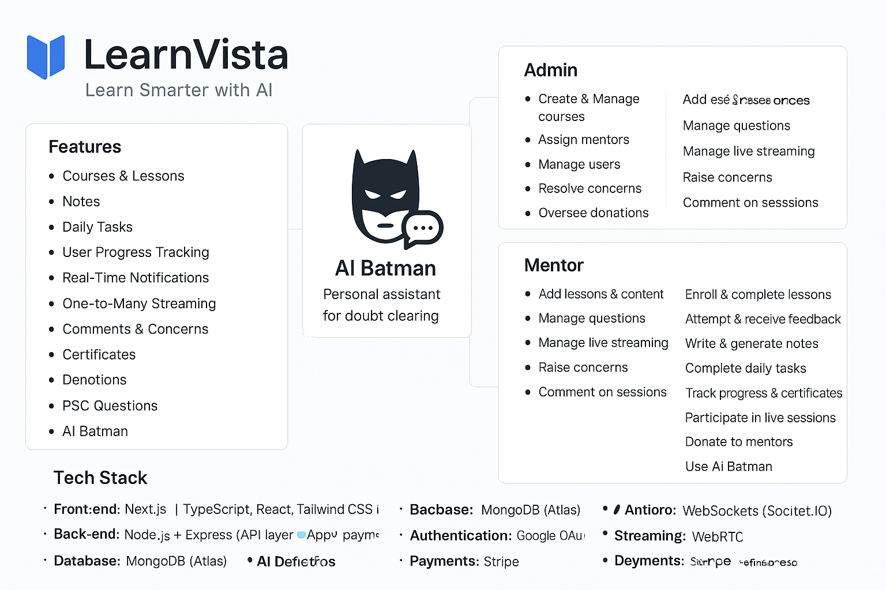

# LearnVista

LearnVista is a modern AI-powered e-learning platform designed to make learning smarter, faster, and more interactive. Built with Next.js, TypeScript, and TailwindCSS, it delivers a seamless experience with AI-enhanced tools, live streaming, and comprehensive course management.

LearnVista – Learn Smarter with AI. Now with AI Batman, your personal assistant for clearing doubts, providing explanations, and guiding you through learning challenges in real-time.

## Features

### Authentication
- Google OAuth login & JWT-based session management
- Secure password management & reset options

### Courses & Lessons
- Structured learning with:
  - Theory questions
  - Practical tasks
  - MCQs
- AI-enhanced evaluation: automated scoring and personalized feedback
- AI answer comparison: see how your answer differs from the correct one
- Marking system: total marks per lesson displayed
- Lesson content stored securely in AWS S3

### Notes
- Add and view personal lesson notes
- AI-enhanced notes with suggestions and clarity improvements

### Daily Tasks
- Practice in Speaking, Writing, and Listening
- Personalized daily tasks for skill improvement

### User Progress Tracking
- Track lesson completion, scores, certificates, and task history
- Personalized dashboard with achievements

### Real-Time Notifications
- Course updates, AI feedback, reminders, and alerts via WebSockets (Socket.IO)

### One-to-Many Streaming
- Live mentor-led sessions
- Interactive Q&A with participants

### Comments & Concerns
- Students and mentors can comment on sessions
- Mentors can raise concerns to admin

### Certificates
- Issue and verify digital certificates
- Support for certificate revocation

### Donations
- Students can support mentors via Stripe payments

### PSC Questions
- AI-generated PSC (Public Service Commission) practice questions integrated directly into LearnVista

### AI Batman
- Personal AI assistant for:
  - Doubt clarification
  - Lesson explanations
  - Step-by-step guidance on practical tasks
  - Intelligent suggestions to improve learning efficiency

## Roles & Permissions
**Admin**
- Create and manage courses
- Assign mentors
- Manage students & mentors
- Resolve concerns
- Oversee donations
- Full platform control (notifications, reports, progress tracking)

**Mentor**
- Add lessons and content
- Create and manage questions
- AI-powered question generation
- Manage live streaming classes
- Raise concerns to admin
- Comment in sessions
- Profile management

**Student**
- Enroll and complete courses
- Attempt theory, practical, and MCQ questions
- Receive AI-based feedback
- Write and generate AI-enhanced notes
- Complete daily tasks
- Track progress and certificates
- Participate in live sessions
- Donate to mentors
- Practice AI-generated PSC questions
- Use AI Batman for doubts

## Tech Stack
- **Frontend:** Next.js (App Router), TypeScript, React, TailwindCSS, shadcn/ui
- **Backend:** Node.js + Express (API layer), Repository Pattern (Clean Architecture)
- **Database:** MongoDB (Atlas)
- **Authentication:** Google OAuth + JWT
- **AI:** Integrated AI services for Notes enhancement, Evaluation & feedback, PSC question generation, AI Batman for doubts
- **Storage:** AWS S3 for lesson videos and course materials
- **Notifications:** WebSockets (Socket.IO)
- **Streaming:** WebRTC / Live streaming server (one-to-many sessions)
- **Payments:** Stripe (donations & future monetization)

## Deployment
- Dockerized deployment with Docker & Docker Compose
- CI/CD with GitHub Actions, hosted on AWS EC2 with Nginx

## LearnVista Vision
To empower learners with AI-enhanced tools and mentorship, making education more interactive, personalized, and efficient. With AI Batman, students have a 24/7 virtual mentor to clarify doubts, explain concepts, and provide guided learning.
